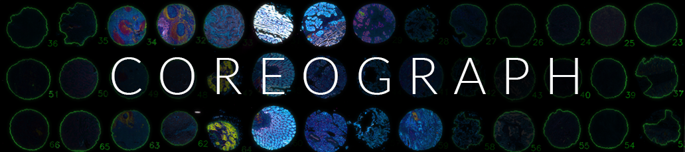
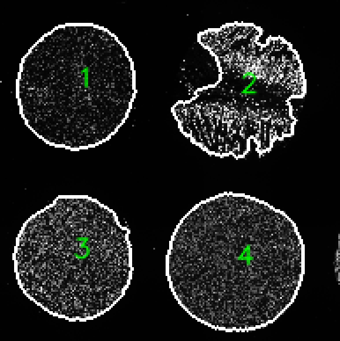
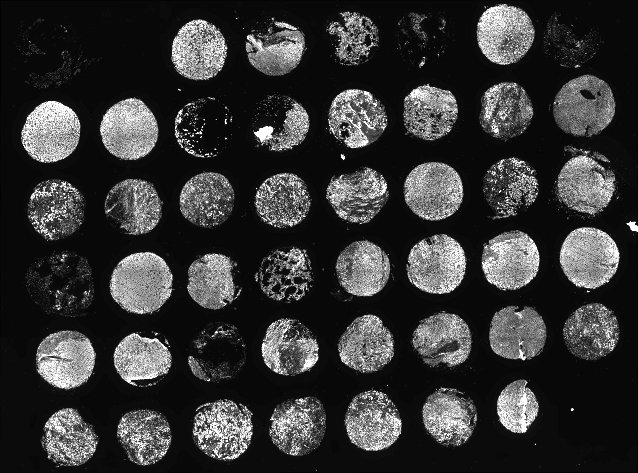
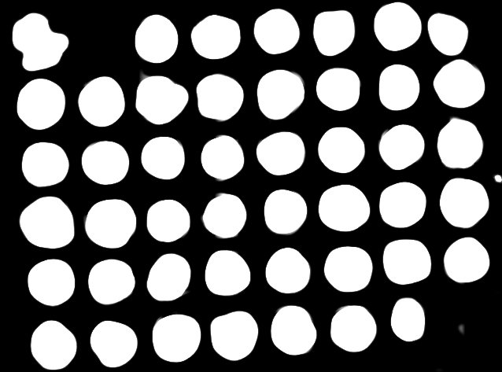
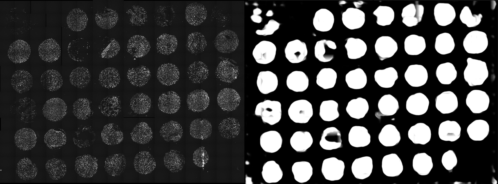
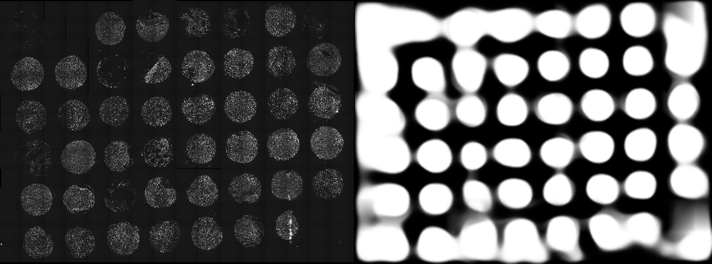

  Great....yet another TMA dearray program. What does this one do?

 
 

Coreograph uses UNet [(Ronneberger et al., 2015)](https://arxiv.org/abs/1505.04597), a deep learning model, to identify complete/incomplete tissue cores on a tissue microarray, and export them individually for faster downstream processing. It has been trained on 9 TMA slides of different sizes and tissue types.

Training sets were acquired at 0.65 microns/pixel resolution and downsampled 1/32 times, **or 2^5 times**, to speed up performance. Once the center of each core has been identifed, active contours is used to generate a tissue mask of each core that can aid downstream single cell segmentation. A GPU is not required but will reduce computation time.

## Prerequisitie input files:
-a fluorescence image of a tissue microarray where at least one channel is of DNA, ie. labelled with Hoechst or DAPI. The image will likely be a stitched images that spans multiple tiles.  

## Parameter list:
The Coreograph parameters described in this manual should be provided to mcmicro via the `--core-opts` flag, as shown in [Parameter Reference examples](parameter-reference.html#parameters-for-individual-modules).  
1. `--downsampleFactor` : how many times to downsample the raw image file. **Default is 5 times to match the training data.**  
2. `--channel` : which is the channel to feed into UNet and generate probabiltiy maps from. This is usually a DAPI channel.  
3. `--buffer` : the extra space around a core before cropping it. A value of 2 means there is twice the width of the core added as buffer around it. 2 is default.  
4. `--outputChan` : a range of channels to be exported. -1 is default and will export all channels (takes awhile). Select a single channel or a continuous range. --outputChan 0 10 will export channel 0 up to and including channel 10.  

## Output files:
1. individual cores as tiff stacks with user-selectable channel ranges
2. binary tissue masks (saved in the 'mask' subfolder)
3. a TMA map showing the labels and outlines of each core for quality control purposes 
4. a text file listing the centroids of each core in the format: Y, X

 

## Scenarios
**NOTE: When using Coreograph on O2, the O2tma profile should be used!!** 
### **1. Alright, let's get started!**
When using MCMICRO, Coreograph does not require any additional input parameters to run. The DNA channel is assumed to be in the 1st channel. 
`--core-opts: <leave blank>` 

 

As one can see, each core is labelled with a single number implying that each core was found uniquely. Furthermore, each core has a thick white line to indicate the accuracy of segmenting each core. (Future versions will have a colored outlines for better visibility).

### **2. Well, my DNA channel is not in the 1st channel.**
No problem! Specify `--channel` with the channel that it's in. This is 0-indexing. So 1st channel is 0. If it's in the 4th channel, 
`--core-opts: --channel 3`

### **3. The cores aren't being found properly.**
Coreograph is trained on various core sizes ranging from 500 microns to 2 mm acquired at a pixel size of 0.65 microns per pixel and then downsampled 5 times. If your core size or image resolution are significantly different, you will need to either upsample or downsample a different number of times using `--downSampleFactor`. See below for examples:

#### 3a) If your pixel size is 0.325 microns per pixel, then your pixel size is double the training data by a factor of 2 (0.65/0.325). You should downsample more times. Use 6 instead of 5.  
 
`--core-opts: --downsampleFactor 6` 

#### 3b) If your pixel size is 1.3 microns per pixel, then your pixel size is half of the training data (0.65/1.3). Instead of downsampling by 5 times (default), you should downsample less. Try 4.
 
`--core-opts: --downsampleFactor 4` 

