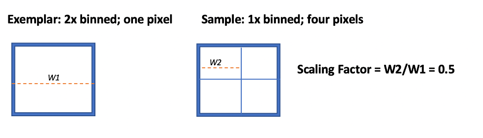

# Frequently Asked Questions

## Pre-processing

### Q: How does mcmicro handle multi-file formats such as `.xdce`?

A: Registration and illumination correction modules in mcmicro are [Bio-Formats compatible](https://docs.openmicroscopy.org/bio-formats/6.0.1/supported-formats.html). Place all files into the `raw/` subdirectory, as described in [Directory Structure](directory-structure.html), and mcmicro modules will correctly identify and use the relevant ones.

## Segmentation

### Q: How do I run mcmicro with my own ilastik model?

A: Use the `--ilastik-model` parameter. Note that the parameter must be specified *outside** `--ilastik-opts`. For example,

```
nextflow run labsyspharm/mcmicro --in /my/data --probability-maps ilastik --ilastik-model mymodel.ilp
```

### Q: How do I check the quality of segmentation?

A: After a successful mcmicro run, two-channel tif files containing DAPI and nuclei/cell/cytoplasm outlines will reside in `qc/s3seg`. Segmentation quality can be assessed through visual inspection of these files in, e.g., [napari](https://napari.org/).

### Q: How do I handle images acquired without pixel binning?



A: There are two adjustments to make:

1. Adjust `--scalingFactor` for UnMicst, which controls the ratio of the current pixel width (W2) to exemplar pixel width (W1) and is not related to area (See schematic).
1. In S3Segmenter, `--cytoDilation` controls the number of pixels from the edge of the nucleus to expand in creating the cytoplasm mask. Take the value optimized for 2x binned images and multiply it by 2 (i.e., if `--cytoDilation 3` is optimal for 2x binning, then the new value will `--cytoDilation 6`).

Use `--unmicst-opts` and `--s3seg-opts` to pass the new values to UnMicst and S3Segmenter, respectively:

```
nextflow run labsyspharm/mcmicro --in /path/to/unbinned/data --unmicst-opts '--scalingFactor 0.5' --s3seg-opts '--cytoDilation 6'
```

