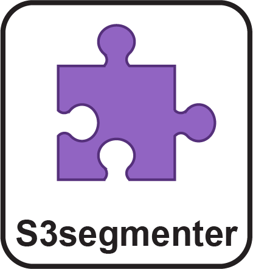

{: .text-center }
# The MCMICRO pipeline

 

{: .fw-400}
{: .fs-7}
{: .text-blue-000}
Current modules:

{: .fw-300}
{: .fs-4}
{: .text-grey-dk-250}
 *Click image to learn more:*

	

	

	

	

	

	

	

<!-- end grid -->

## BaSiC
{: .fw-500}
{: .text-yellow-100}
Illumination correction

* BaSiC generally works well with default parameters.

* BaSiC was developed externally by [(Peng et al., 2017)](https://doi.org/10.1038/ncomms14836){:target="_blank"} - we recommend referring to the manuscript for more detailed parameter tuning information. 

* The BaSiC software is found on [GitHub](https://github.com/labsyspharm/basic-illumination){:target="_blank"} with an accompanying [ReadMe](https://github.com/labsyspharm/basic-illumination#running-as-a-docker-container){:target="_blank"}. 

## ASHLAR
{: .fw-500}
{: .text-yellow-200}
*Stitching and registration*

{: .fw-200}
{: .fs-3}
Last updated on 03-15-2022, check the [ASHLAR website](https://labsyspharm.github.io/ashlar){:target="_blank"} for the most up-to-date documentation.

## Coreograph
{: .fw-500}
{: .text-red-300}
*TMA core detection*

## UnMICST
{: .fw-500}
{: .text-red-100}
*Image segmentation - probability map generation*

{: .fw-200}
{: .fs-3}
Last updated on 03-15-2022, check the [UnMICST website](https://labsyspharm.github.io/UnMICST-info/){:target="_blank"} for the most up-to-date documentation.

## S3segmenter
{: .fw-500}
{: .text-purple-000}
*Image segmentation - cell mask generation*

## MCQuant
{: .fw-500}
{: .text-purple-200}
*Single-cell data quantification*

{: .fw-200}
{: .fs-3}
Last updated on 03-15-2022, check the [MCQuant README](https://github.com/labsyspharm/quantification#single-cell-quantification){:target="_blank"} for the most up-to-date documentation.

## CyLinter
{: .fw-500}
{: .text-red-000}
*Quality control*

{: .fw-200}
{: .fs-3}
Last updated on 03-15-2022, check the [CyLinter website](https://labsyspharm.github.io/cylinter/){:target="_blank"} for the most up-to-date documentation.

CyLinter takes single-cell feature tables generated by the MCMICRO image processing pipeline as input and returns a set of de-noised feature tables for use in downstream analyses. 

## SCIMAP
{: .fw-500}
{: .text-blue-100}
*Data analysis*

{: .fw-200}
{: .fs-3}
Last updated on 03-15-2022, check the [SCIMAP website](https://scimap.xyz){:target="_blank"} for the most up-to-date documentation.

## Minerva
{: .fw-500}
{: .text-green-200}
*Interactive viewing and sharing*

Minerva is used in parallel with MCMICRO, so the image outputs need to be run through Minerva separately. To learn more about how to use Minerva, visit the [Minerva wiki](https://github.com/labsyspharm/minerva-story/wiki){:target="_blank"} for the most up-to-date information about the Minerva suite.

## Other modules

| Name | Purpose | References |
| :-- | :-- | :-- | :-- |
| [Ilastik](./other.html#ilastik) | Probability map generator | [Code](https://github.com/labsyspharm/mcmicro-ilastik) - [DOI](https://doi.org/10.1038/s41592-019-0582-9) |
| [Cypository](./other.html#ilastik) | Probability map generator (cytoplasm only) | [Code](https://github.com/HMS-IDAC/Cypository) |
| [naivestates](./other.html#naivestates) | Cell type calling | [Code](https://github.com/labsyspharm/naivestates) |
| [FastPG](./other.html#fastpg) | Cell type calling | [Code](https://github.com/labsyspharm/celluster) - [DOI](https://www.biorxiv.org/content/10.1101/2020.06.19.159749v2) |

# Suggest a module

Module suggestions can be made by posting to [https://forum.image.sc/](https://forum.image.sc/) and tagging your post with the `mcmicro` tag.

# Add a module

MCMICRO allows for certain module types to be specified dynamically through a configuration file. If you already have a containerized method with a command-line interface, follow [our instructions]({{ site.baseurl }}/instructions/advanced-topics/adding.html) to incorporate your module into the pipeline.

{: .no_toc }