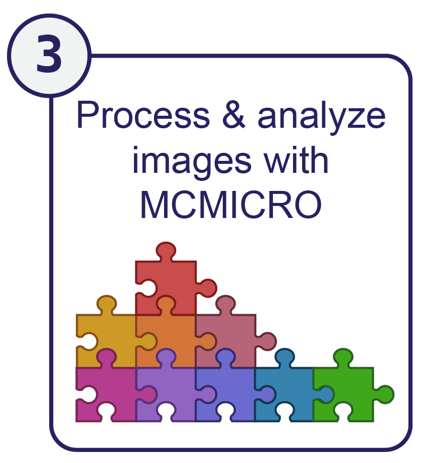

{: .no_toc }

  

    Table of contents
  

  {: .text-delta }
1. TOC
{:toc}

# Phase 1: Staining proteins or molecules in biological samples

To diagnose disease, doctors often biopsy patients, removing a small, 2-4 mm cylindrical tissue sample of tissue that can be studied in greater detail under a microscope. A pathologist receives this biopsy, treats it with preservative chemicals, slices it into 1-10 μm sections, and adheres these slices to microscope slides. The pathologist then stains the slides with molecules that allow them to visualize various aspects of the tissue [(Boyle et al., 2008)](https://doi.org/10.1002/bmb.20192){:target="_blank"}. There are several methods to staining tissues – here we describe two classical methods. First, we describe the colorimetric stains - the gold standard for pathology diagnoses. Second, we discuss immunoflourescence - a technique that allows multiple proteins or molecules within a sample to be visualized simultaneously. 

### Hematoxylin and eosin (H&E) and colorimetric stains

Pathologists stain tissue components with colorimetric dyes to visualize subtle differences within tissue samples ([Albertson et al., 2006;](https://doi.org/10.1016/j.tig.2006.06.007){:target="_blank"} [Shlien et al., 2009](https://doi.org/10.1186/gm62){:target="_blank"}). Hematoxylin and Eosin stains (H&E) are one of the most common dyes used to stain biological tissues for pathological analysis. Hematoxylin stains nuclei purple and eosin stains extracellular matrix and cytoplasm pink, while other cell structures display colors in-between. The use of H&E stained samples to diagnose or treat disease - known as histopathology - remains the primary way that diseases such as cancer are staged and managed [(Amin et al., 2017)](https://doi.org/10.3322/caac.21388){:target="_blank"}. As such, histopathology is a critical component of disease diagnosis and treatment, but it provides a limited view of the specific molecular interactions that are happening within a tissue.

{: .text-center }
{: .fs-3 }
{: .fw-300 }
<figure>
	 <figcaption>The image above shows an example H&E stained pancreatic ductal adenocarcinoma (PDAC) specimen that includes portions of cancerous and non-malignant pancreatic tissue and small intestine. From Lin et al., 2018.</figcaption> 
</figure>

### Immunofluorescence
Alternatively, antibodies can tag specific cell components with high affinity, yielding molecular-level information. Antibodies are produced by an animal (such as a mouse, rat, or goat) to target a specific protein or molecule antigen - known as a _marker_. These antibodies are incubated with the sample where they bind their target with high affinity then excess unbound antibodies are rinsed away. Fluorescent molecules can then reveal the location of these antibodies within the sample. Generally, this is done with ‘secondary’ antibodies conjugated to fluorescent molecules that bind antigens from a specific species of animal (i.e. anti-mouse secondary antibodies will bind mouse-origin antibodies). This allows 4-6 markers to be visualized within a single sample through immunofluorescence by using antibodies with different species origins [(Boyle et al., 2008)](https://doi.org/10.1002/bmb.20192){:target="_blank"}. 

{: .text-center }
{: .fs-3 }
{: .fw-300 }
<figure>
	 <figcaption>An immunofluorescent PDAC specimen that corresponds to the H&E PDAC specimen shown above. From Lin et al., 2018.</figcaption> 
</figure>

# Phase 2: Imaging immunofluorescent biological samples

After staining with antibodies, immunofluorescence microscopy is used to image these specific proteins within the sample. A microscope pulses the sample with a specific wavelength of light. The light excites the fluorophore - triggering the fluorophore to emit light. The microscope detects the light emitted by the fluorophore, thus capturing the location of the fluorescent antibody within the sample [(Boyle et al., 2008)](https://doi.org/10.1002/bmb.20192){:target="_blank"}. The specific excitation and emission wavelengths are fluorophore-dependent, so it is possible to carefully select 4-6 fluorophores that can be imaged simultaneously (and many [references](https://www.geomcnamara.com/data){:target="_blank"} exist to help with this selection).

Classical immunofluorescence is generally performed only once per sample. However, several new techniques enable multiple rounds of immunofluorescence to be performed on a single sample. These multiplexed imaging techniques include cyclic immunofluorescence (CyCIF) [(Lin et al., 2018)](https://doi.org/10.7554/eLife.31657){:target="_blank"}, Multiplexed Immunofluorescence (MxIF) [(Gerdes et al., 2013)](https://doi.org/10.1073/pnas.1300136110){:target="_blank"}, CO-Detection by indEXing (CODEX) [(Goltsev et al., 2018)](https://doi.org/10.1016/j.cell.2018.07.010){:target="_blank"}, and Signal Amplification by Exchange Reaction (immuno-SABER) [(Saka et al., 2019)](https://doi.org/10.1038/s41587-019-0207-y){:target="_blank"}. The precise methods vary per technique, but as an example, CyCIF deactivates prior fluorophores between rounds of staining and imaging to allow for 8-20 cycles of imaging per sample [(Lin et al., 2018)](https://doi.org/10.7554/eLife.31657){:target="_blank"}.

{: .text-center }
{: .fs-3 }
{: .fw-300 }

CyCIF schematic from Lin et al., 2018.

All these imaging methods generate data that can be represented as a series of intensity values on a two-dimensional raster, or grid. Imaging multiple fluorophores simply adds a dimension to the raster that's referred to as a separate channel. MCMICRO can process the 2D data from all methods mentioned above – extension to 3D is an area of active interest.

### Data and metadata formats
The TIFF (Tagged Image File Format) is ideal for storing microscopy data at native resolution because it can combine multiple images in a single file (with each image occupying a separate layer in the file). 

TIFF files also contain metadata in the header that describes the organization and key properties of the images. For biomedical data, the [Open Microscopy Environment](https://www.openmicroscopy.org/ome-files/){:target="_blank"} (OME) TIFF format has become the most widely used standard for XML-based metadata and raster images. Because different vendors also have their own internal data standards, [Bio-Formats](https://www.openmicroscopy.org/bio-formats/){:target="_blank"} software was developed by the OME community to convert proprietary formats into a standardized, open format, most recently [OME-TIFF 6.0](https://docs.openmicroscopy.org/ome-model/6.0.1/ome-tiff/){:target="_blank"}. This is a pyramid-encoded TIFF in which multiple resolutions of the same image are found in a single file to enable rapid pan and zoom, particularly using web tools (e.g. Google Maps). Many microscope vendors support Bio-Formats and it is the standard supported by MCMICRO and other image processing software developed by the Laboratory of Systems Pharmacology.

Metadata standards for high-plex image data are rapidly developing: a wide variety of laboratories have come together to create the Minimum Information about Tissue Imaging Standard [(MITI) (Schapiro et al., 2021)](https://doi.org/10.1038/s41592-022-01415-4){:target="_blank"}. 

 

**Go back to overview to learn how these images are processed and analyzed by MCMICRO**

<!-- end grid -->