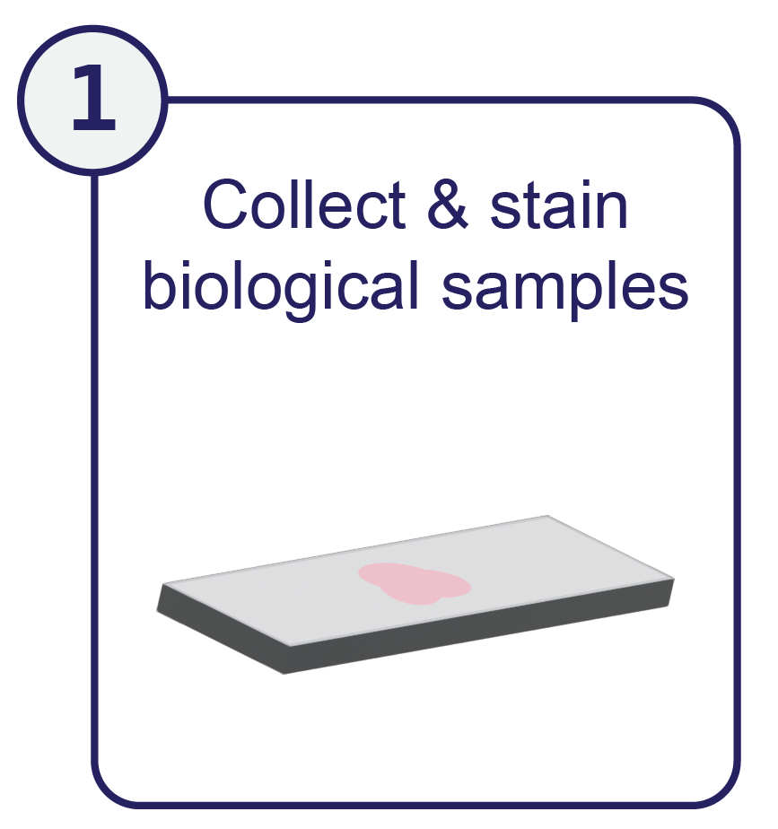
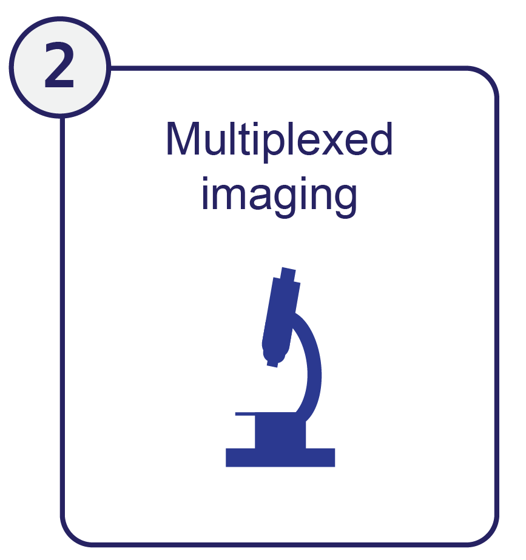

# Overview Video



A general introduction [video](https://www.youtube.com/watch?v=fnxBvgJQmtY){:target="_blank"} that provides a high-level overview of the pipeline.

---
# Overview of multiplexed tissue imaging collection, processing, and analysis

Multiplexed tissue imaging has three distinct phases. In the first phase, tissue samples are collected, brought into a laboratory, and stained to highlight specific proteins and molecules within the tissue. In the second phase, these samples are imaged on a microscope. In the third phase these images need to be processed and analyzed. Processing and analyzing multiplexed images - which can encompass massive amounts of data - is a computationally intensive task.  

{: .text-center }
**MCMICRO provides a modular solution to this problem.**

In the following pages, we introduce some key background information relevant to highly multiplexed tissue imaging. These sections provide context on tissue imaging and highlight the need for MCMICRO -- **jump around as needed!**

<!-- end grid -->