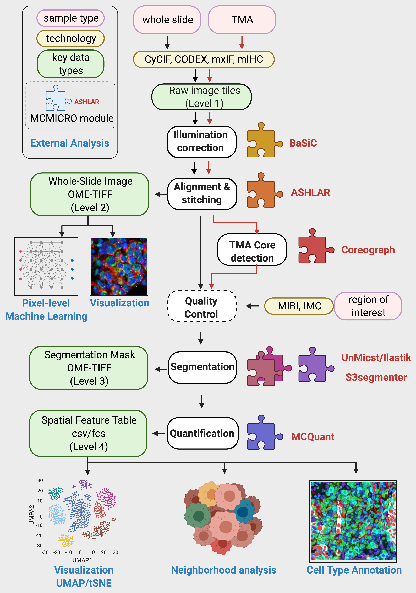

# Directory structure
Upon the full successful completion of a pipeline run, the directory structure will follow Fig. 1A in the [mcmicro manuscript](https://www.biorxiv.org/content/10.1101/2021.03.15.435473v1):

| Schematic | Directory&nbsp;Structure |
| :-: | :-- |
|  | <code>exemplar-002<br>├── markers.csv<br>├── raw/<br>├── illumination/<br>├── registration/<br>├── dearray/<br>├── probability-maps/<br>├── segmentation/<br>├── quantification/<br>└── qc/<br></code> |

The name of the parent directory (e.g., `exemplar-002`) is assumed by the pipeline to be the sample name.

## Segmentation

Cell segmentation is carried out in two steps. First, the pipeline generates probability maps that annotate each pixel with the probability that it belongs to a given subcellular component (nucleus, cytoplasm, cell boundary). The second step applies standard watershed segmentation to produce the final cell/nucleus/cytoplasm/etc. masks. The two steps will appear in `probability-maps/` and `segmentation` directories, respectively. When there are multiple modules for a given pipeline step, their results will be subdivided into additional subdirectories:

```
exemplar-001
├── ...
├── probability-maps/
│   ├── ilastik/
│   │   └── exemplar-001_Probabilities.tif
│   └── unmicst/
│       └── exemplar-001_Probabilities_0.tif
└── segmentation/
    ├── ilastik-exemplar-001/
    │   ├── cellMask.tif
    │   └── nucleiMask.tif
    └── unmicst-exemplar-001/
        ├── cellMask.tif
        └── nucleiMask.tif
```

## Quantification

The final step combines information in segmentation masks, the original stitched image and `markers.csv` to produce *Spatial Feature Tables* that summarize the expression of every marker on a per-cell basis, alongside additional morphological features (cell shape, size, etc.). Spatial Feature Tables will be published to the `quantification/` directory:

```
exemplar-001
├── ...
├── segmentation/
└── quantification/
    ├── ilastik-exemplar-001.csv
    └── unmicst-exemplar-001.csv
```

There is a direct correspondence between colunn name suffixes in the `.csv` files and the filenames of segmentation masks. For example, the column `CD357_cellMask` in `quantification/unmicst-exemplar-001.csv` quantifies the expression of `CD357` that was computed over `segmentation/unmicst-exemplar-001/cellMask.tif`. Similarly, `FDX1_nucleiMask` quantified the expression of `FDX1` computed over `segmentation/unmicst-exemplar-001/nucleiMask.tif`.

## Quality control

Additional information during pipeline execution will be written to the `qc/` directory, by both individual modules and the pipeline itself.

```
exemplar-002
├── ...
└── qc
    ├── params.yml
    ├── provenance/
    │   ├── probmaps:ilastik (1).log
    │   ├── probmaps:ilastik (1).sh
    │   ├── probmaps:unmicst (1).log
    │   ├── probmaps:unmicst (1).sh
    │   ├── quantification (1).log
    │   ├── quantification (1).sh
    │   └── ...
    ├── coreo/
    ├── s3seg/
    └── unmicst/
```

While the exact content of the `qc/` directory will depend on which modules were executed, two sources of information can always be found there:

1. The file `params.yml` will contain the full record of module versions and all parameters used to run the pipeline. This allows for full reproducibility of future runs.
1. The `provenance/` subdirectory will contain exact commands (`.sh`) executed by individual modules, as well the output (`.log`) of these commands.

The remaining directories will contain QC files specific to individual modules:

1. When working with TMAs, `coreo/` will contain `TMA_MAP.tif`, a mask showing where in the original TMA image the segmented cores reside.
1. If UnMicst was used to generate probability maps, `unmicst/` will contain thumbnail previews, allowing for a quick assessment of their quality.
1. After segmentation, two-channel tif files containing DAPI and nuclei/cell/cytoplasm outlines will reside in `s3seg/`, allowing for a visual inspection of segmentation quality.

After sufficient quality of the outputs has been established and no more parameter tuning is expected, the QC files can be safely deleted. It is recommended to retain `params.yml` and `provenance/` because of their relatively small file size, given that these files enable full reproducibility of a pipeline run.
