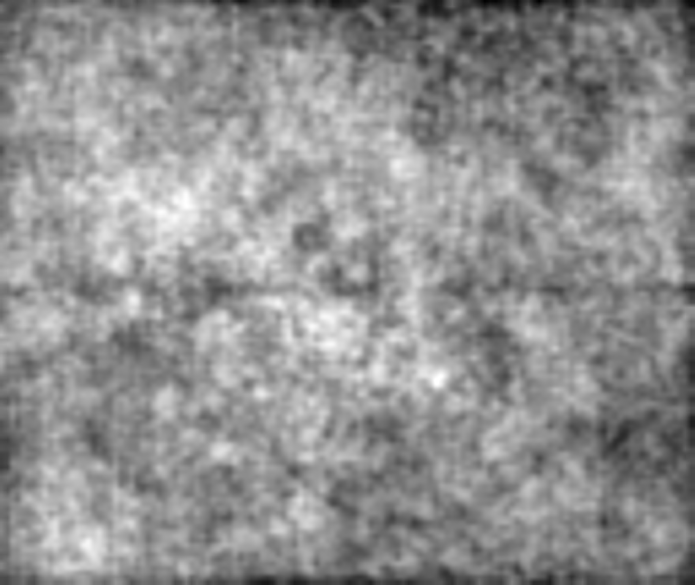
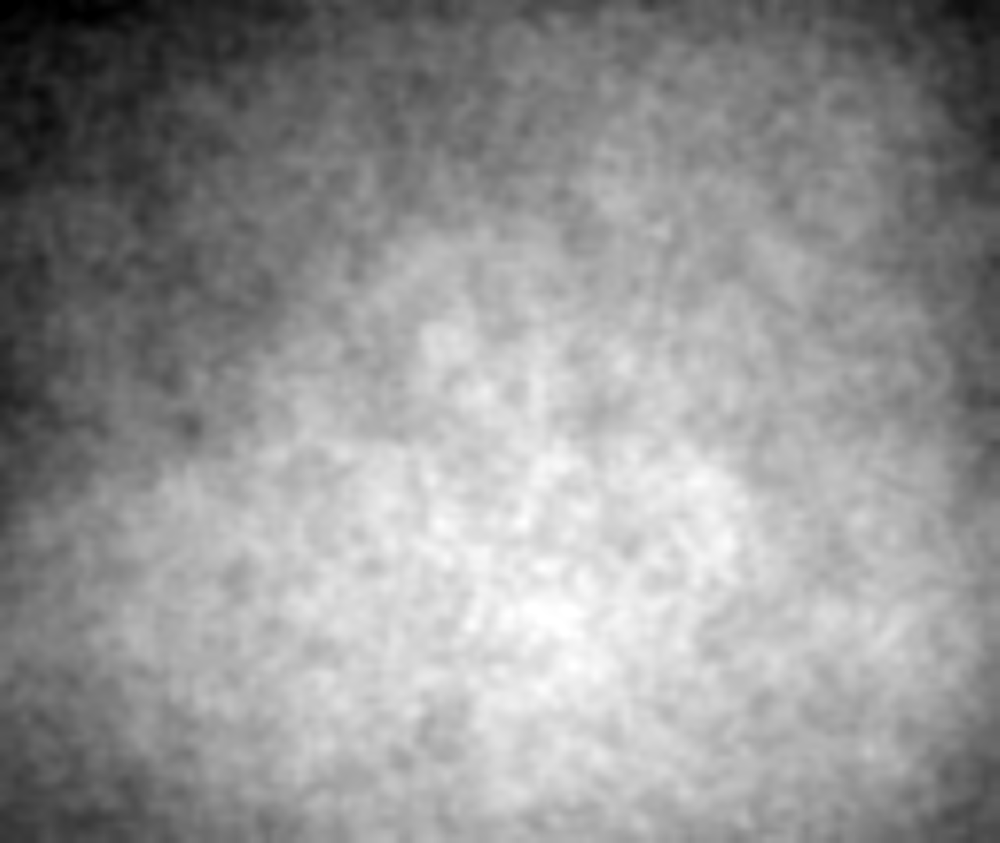
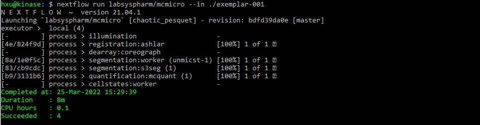
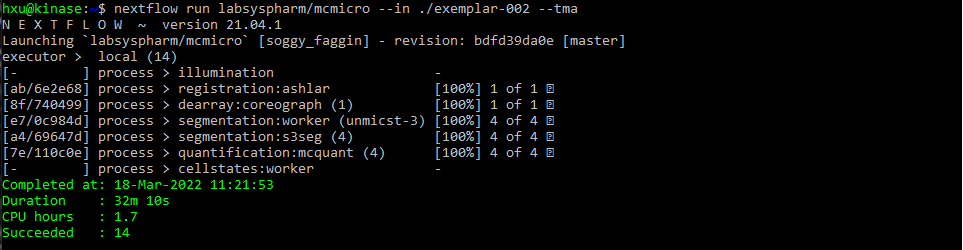
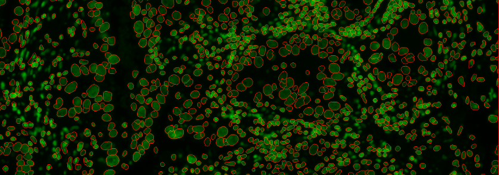
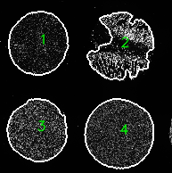

# MCMICRO tutorial

{: .fs-5}
{: .fw-500}
Here we show an example of how to execute MCMICRO on two exemplar datasets using the command line (Nextflow) interface on a local computer. 

{: .fs-3}
**Note:** *Nextflow is compatible with Linux or Mac (through the terminal), but Windows users will need to set up a [Windows Subsystem for Linux](https://docs.microsoft.com/en-us/windows/wsl/about){:target="_blank"} or use the [Galaxy workflow]({{site.baseurl}}/platforms/galaxy/).*

*If you are not running MCMICRO on your local computer, please head to [Platforms]({{site.baseurl}}/platforms/) for platform-specific instructions.*


---
**Following this tutorial can verify that MCMICRO is correctly installed and running on your computer by demonstrating the expected inputs and outputs for the exemplar datasets.**

---

{: .fs-6}
 **Step 0:** Be sure to [install](../tutorial/installation.html) nextflow and Docker before proceeding through these steps.
 
Enter the commands `nextflow run hello` and `docker run hello-world` to verify that both Nexflow and Docker* are functional.

*\*If using a Windows environment, you may need to run Docker as Administrator.*

*\*If using a MacOS environment, you may need to increase the amount of [RAM allocated to Docker](https://docs.docker.com/desktop/mac/#resources){:target="_blank"}.*

<br>

{: .fs-6}
 **Step 1:** Ensure you have the latest version of the pipeline 

``` bash
nextflow pull labsyspharm/mcmicro
```

<br>

{: .fs-6}
**Step 2:** [Download]({{ site.baseurl }}/datasets/) exemplar data. 

Replace `/my/path` with where you want to store the files. (Use `.` for path to download files into the current directory.)

``` bash
# Download exemplar-001
nextflow run labsyspharm/mcmicro/exemplar.nf --name exemplar-001 --path /my/path

# Download exemplar-002
nextflow run labsyspharm/mcmicro/exemplar.nf --name exemplar-002 --path /my/path
```

Both exemplar datasets have the [directory structure]({{ site.baseurl }}/io.html#input) of

``` bash
exemplar-001 or exemplar-002
├── markers.csv
├── raw/
|   ├── exemplar-001-cycle-06.ome
|   ├── exemplar-001-cycle-07.ome
|   └── ...
|   
└── illumination/
    ├── ...
    ├── exemplar-001-cycle-06-dfp.tif
    ├── exemplar-001-cycle-06-ffp.tif
    ├── ...
    └── ...
```

By default, `exemplar-001` contains cycles 6 through 8, while exemplar-002 contains all 10 cycles. Use `nextflow run labsyspharm/mcmicro/exemplar.nf --help` to learn how to download a different range of cycles for each exemplar.

Each cycle has one `.ome.tif` file in `raw/` and two `.tif` files in `illumination/`. These images look like the following:

<div class="row">
<div class="col-xs-4 col-sm-4">
<div markdown="1">


{: .fs-3}
{: .fw-200}
`exemplar-001-cycle-06.ome.tif`

{: .fs-3}
{: .fw-200}
*This is the first image in a stack of 24 images showing the Hoechst stain for DNA.*
</div>
</div>

<div class="col-xs-4 col-sm-4">
<div markdown="1">


{: .fs-3}
{: .fw-200}
`exemplar-001-cycle-06-dfp.tif`

{: .fs-3}
{: .fw-200}
*This is the first image of a stack of 4 images, previewed in Fiji with auto adjustments made to brightness and contrast. The image contains the dark-field illumination profile.*
</div>
</div>

<div class="col-xs-4 col-sm-4">
<div markdown="1">


{: .fs-3}
{: .fw-200}
`exemplar-001-cycle-06-ffp.tif`

{: .fs-3}
{: .fw-200}
*This is the first image of a stack of 4 images, previewed in Fiji with auto adjustments made to brightness and contrast. The image contains the flat-field illumination profile.*
</div>
</div>

</div>

<br>

{: .fs-6}
**Step 3:** Use `--in` to point the pipeline at the data.  

In the commands below, `/my/path` should match what was used to download exemplar data with `exemplar.nf` command above (`.` can again be used to point to the current directory).

``` bash
# Run the pipeline on exemplar data (starting from the registration step, by default)
nextflow run labsyspharm/mcmicro --in /my/path/exemplar-001

# params.yml in exemplar-002 will tell MCMICRO to treat data as a tissue microarray
nextflow run labsyspharm/mcmicro --in /my/path/exemplar-002
```

*If your computer has an **Apple M1 chip**, you may need to specify ilastik for probability maps at this step. Read more on the [FAQ page]({{site.baseurl}}/troubleshooting/faq.html#q-my-computer-has-an-apple-m1-chip-and-the-pipeline-is-failing-at-the-segmentation-step-what-can-i-do).*

*On an average workstation, it takes approximately 5-10 minutes to process exemplar-001 from start to finish. Exemplar-002 is substantially larger, and takes 30-40 minutes on an average workstation.


{: .fs-3}
{: .fw-200}
*After a successful run, the following text will be displayed for exemplar-001 and exemplar-002:*





{: .fs-3}
{: .fw-200}
*The pipeline will generate the following directory, depending on the modules used.* 

<style>
  code {
    white-space : pre-wrap !important;
    word-break: break-word;
  }
  details > summary {
    color: #00B0E9;
    font-weight: bold;
  }
</style>

<details>

<summary>Expand to see exemplar-001 and exemplar-002 output files*</summary>

<div markdown="1">
*\*`raw/` and `illumination/` contents will remain the same.*
</div>

<div class="row">

<div class="col-xs-12 col-sm-6">
<div markdown="1">

``` bash
exemplar-001
├── markers.csv
├── raw/
├── illumination/
├── registration/
|  └── exemplar-001.ome
├── probability-maps/
|   └── unmicst/    
|       └── exemplar-001-pmap.tif
├── segmentation/
|   ├── cell.ome
|   └── nuclei.ome
├── quantification/
|   └── unmicst-exemplar-001_cell.csv
└── qc/
   ├── provenance/
   |   ├── quantification·mcquant(1).txt
   |   ├── quantification·mcquant(1).sh
   |   ├── reigstration·ashlar.txt
   |   ├── registration·ashlar.sh
   |   ├── segmentation·s3seg(1).txt
   |   ├── segmentation·s3seg(1).sh
   |   ├── segmentation·worker(unmicst-1).txt
   |   └── segmentation·workder(unmicst-1).sh
   ├── s3seg/
   |   └── unmicst-exemplar-001/
   |       ├── cellOutlines.ome
   |       └── nucleiOutlines.ome
   ├── unmicst/
   |   └── exemplar-001-Preview_1.tif
   └── params.yml


```
</div>
</div>

<div class="col-xs-12 col-sm-6">
<div markdown="1">

``` bash
exemplar-002
├── markers.csv
├── raw/
├── illumination/
├── registration/
|   └── exemplar-002.ome
├── dearray/
|   ├── masks/
|   |   ├── 1_mask.tif
|   |   ├── 2_mask.tif
|   |   ├── 3_mask.tif
|   |   └── 4_mask.tif
|   ├── 1.tif
|   ├── 2.tif
|   ├── 3.tif
|   └── 4.tif
├── probability-maps/
|   └── unmicst/
|       ├── 1-pmap.tif
|       ├── 2_pmap.tif
|       ├── 3_pmap.tif
|       └── 4_pmap.tif   
├── segmentation/
|   ├── unmicst-1/
|   |   ├── cell.ome
|   |   └── nuclei.ome
|   ├── unmicst-2/
|   |   ├── cell.ome
|   |   └── nuclei.ome
|   ├── unmicst-3/
|   |   ├── cell.ome
|   |   └── nuclei.ome
|   └── unmicst-4/
|       ├── cell.ome
|       └── nuclei.ome
├── quantification/
|   ├── unmicst-1_cell.csv
|   ├── unmicst-2_cell.csv
|   ├── unmicst-3_cell.csv
|   └── unmicst-4_cell.csv
└── qc/
    ├──coreo/
    |  ├── centroidsY-X.txt
    |  └── TMA_MAP.tif
    ├── provenance/
    |   ├── dearraycoreograph(1).txt
    |   ├── dearraycoreograph(1).sh
    |   ├── quantification·mcquant(1).txt
    |   ├── quantification·mcquant(1).sh
    |   ├── ...
    |   ├── quantification·mcquant(4).txt
    |   ├── quantification·mcquant(4).sh 
    |   ├── reigstration·ashlar.txt
    |   ├── registration·ashlar.sh
    |   ├── segmentation·s3seg(1).txt
    |   ├── segmentation·s3seg(1).sh
    |   ├── ...
    |   ├── segmentation·s3seg(4).txt
    |   ├── segmentation·s3seg(4).sh 
    |   ├── segmentation·worker(unmicst-1).txt
    |   ├── segmentation·worker(unmicst-1).sh 
    |   ├── ...
    |   ├── segmentation·worker(unmicst-4).txt
    |   └── segmentation·workder(unmicst-4).sh
    ├── s3seg/
    |   └── unmicst-exemplar-001/
    |       ├── cellOutlines.ome
    |       └── nucleiOutlines.ome
    ├── unmicst/
    |   └── exemplar-001-Preview_1.tif
    └── params.yml
# Working with TMA array (tma:true in params.yml) produces the dearray/ directory
```
</div>
</div>

</div>
</details>

<br>

{: .fs-6}
**Step 4:** *(Recommended)* Visual inspection of quality control (`qc/`) files

Depending on the modules used, directories `coreo/`, `unmicst/` and `s3seg/` may contain `.tif` or `.ome.tif` images for inspection. 

**Here we demonstrate visual inspection using Fiji (Download Fiji [here](https://imagej.net/software/fiji/downloads){:target="_blank"}). You can use any image viewing/processing software that works for `.ome.tif` and `.tif` files.**

<br>

{: .fs-5}
**s3seg/**  

* Check that `cellOutlines.ome.tif` and `nucleiOutlines.ome.tif` show satisfactorily outlined areas

* `cellOutlines.ome.tif` found under `qc/s3seg1/unmicst-exemplar-001/` can be previewed as Hyperstack in Fiji. Each cycle appears as a 2-image stack. 
  
* You can split stack into individual images. Then, choose *Image>Color>Merge Channels* to overlay outline with raw image for visual inspection.

  

  {: .fs-3}
  {: .fw-200}
  `cellOutlines.ome.tif` Cell outlines overlaid with raw image, zoomed in on an arbitrary area. *(This example shows the first available cycle (Cycle 6) in the default exemplar-001 data set .)*

  >Read [Parameter Tuning for S3Segmenter](../troubleshooting/tuning/s3seg.html) for common troubleshooting scenarios.

<br>

{: .fs-5}
**coreo/**

* Check for correct partitioning of TMAs

  

  {: .fs-3}
  {: .fw-200}
  `TMA_MAP.tif` exemplar-002

  >Read [Parameter Tuning for Coreograph](../troubleshooting/tuning/coreograph.html) for common troubleshooting scenarios.
  
<br>

{: .fs-5}
**unmicst/**

* Examination of `qc/unmicst/` is generally not necessary if `qc/s3seg/` outlines are satisfactory

* However, if segmentation results found in `qc/s3seg/` are not desirable, UnMICST `qc` files can provide a clue for what went wrong. 

  >Read [Parameter Tuning for UnMICST](../troubleshooting/tuning/unmicst.html) for common troubleshooting scenarios.

<br>

*More details on output files and quality control can be found in [Inputs/Outputs]({{site.baseurl}}/io.html#output).*
