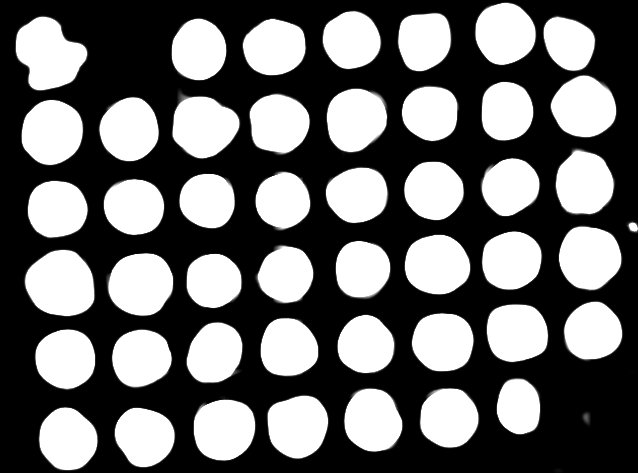

*Great*....yet **another** TMA dearray program. What does *this* one do?

Coreograph uses UNet, a deep learning model, to identify complete/incomplete tissue cores on a tissue microarray. It has been trained on 9 TMA slides of different sizes and tissue types. 

 

Training sets were acquired at 0.2micron/pixel resolution and downsampled 1/32 times to speed up performance. Once the center of each core has been identifed, active contours is used to generate a tissue mask of each core that can aid downstream single cell segmentation. A GPU is not required but will reduce computation time.

*Coreograph exports these files:**
1. individual cores as tiff stacks with user-selectable channel ranges
2. binary tissue masks (saved in the 'mask' subfolder)
3. a TMA map showing the labels and outlines of each core for quality control purposes

*Instructions for use:**
`python UNetCoreograph.py`
1. `--imagePath` : the path to the image file. Should be tif or ome.tif
2. `--outputPath` : the path to save the above-mentioned files
3. `--downsampleFactor` : how many times to downsample the raw image file. Default is 5 times to match the training data.
4. `--channel` : which is the channel to feed into UNet and generate probabiltiy maps from. This is usually a DAPI channel
5. `--buffer` : the extra space around a core before cropping it. A value of 2 means there is twice the width of the core added as buffer around it. 2 is default
6. `--outputChan` : a range of channels to be exported. -1 is default and will export all channels (takes awhile). Select a single channel or a continuous range. --outputChan 0 10 will export channel 0 up to (and NOT including) channel 10

