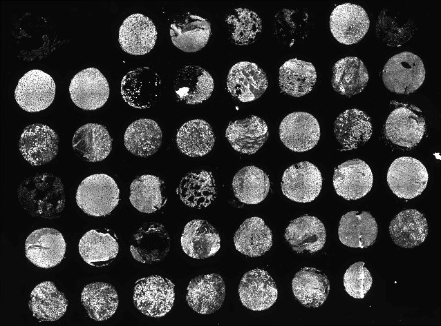

  Great....yet another TMA dearray program. What does this one do?

Coreograph uses UNet, a deep learning model, to identify complete/incomplete tissue cores on a tissue microarray, and export them individually for faster downstream processing. It has been trained on 9 TMA slides of different sizes and tissue types.

 

Training sets were acquired at 0.2micron/pixel resolution and downsampled 1/32 times to speed up performance. Once the center of each core has been identifed, active contours is used to generate a tissue mask of each core that can aid downstream single cell segmentation. A GPU is not required but will reduce computation time.

## Prerequisitie input files:
-a fluorescence image of a tissue microarray where at least one channel is of DNA, ie. labelled with Hoechst or DAPI. The image will likely be a stitched images that spans multiple tiles.  

## Parameter list:
The Coreograph parameters described in this manual should be provided to mcmicro via the `--core-opts` flag, as shown in [Parameter Reference examples](parameter-reference.html#parameters-for-individual-modules).  
1. `--downsampleFactor` : how many times to downsample the raw image file. Default is 5 times to match the training data.  
2. `--channel` : which is the channel to feed into UNet and generate probabiltiy maps from. This is usually a DAPI channel.  
3. `--buffer` : the extra space around a core before cropping it. A value of 2 means there is twice the width of the core added as buffer around it. 2 is default.  
4. `--outputChan` : a range of channels to be exported. -1 is default and will export all channels (takes awhile). Select a single channel or a continuous range. --outputChan 0 10 will export channel 0 up to (and NOT including) channel 10.  

## Output files:
1. individual cores as tiff stacks with user-selectable channel ranges
2. binary tissue masks (saved in the 'mask' subfolder)
3. a TMA map showing the labels and outlines of each core for quality control purposes

## Scenarios
### **1. Alright, let's get started!**
When using MCMICRO, Coreograph does not require any additional input parameters to run. The DNA channel is assumed to be in the 1st channel.
`--core-opts: <leave blank>`

### **2. Well, my DNA channel is not in the 1st channel.
No problem! Specify `--channel` with the channel that it's in. This is 0-indexing. So 1st channel is 0. If it's in the 4th channel,
`--core-opts: --channel 3`

### **3. The cores aren't being found properly.**
Coreograph is trained on various core sizes ranging from 500 microns to 2 mm acquired at a pixel size of 0.65 microns per pixel. If your core size or image resolution are significantly different, you will need to either upsample or downsample the image using `--downSampleFactor`. 

#### 3a) If your pixel size is 1.3 microns per pixel, then you should upsample the image by a factor of 2 (1.3/0.65)
`--core-opts: --downsampleFactor 2`

#### 3b) If your pixel size is 0.325 microns per pixel, then you should upsample the image by a factor of 0.5 (0.325/0.65)
`--core-opts: --downsampleFactor 0.5`

