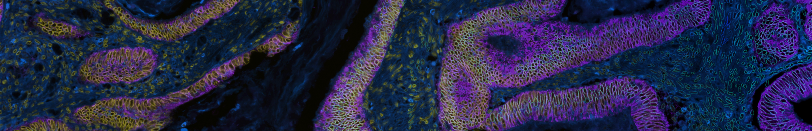

# Automatic Segmentation Manual

So... you want to do single-cell image segmentation?

## Prerequisite input files
S3segmenter assumes that you have:
1. acquired images of your sample with optimal acquisition settings.
2. stitched and registered the tiles and channels respectively (if working with a large piece of tissue) and saved it as a Bioformats compatible tiff file.
3. processed your image in some way so as to increase contrast between individual nuclei using classical or machine learning methods such as ilastik (a random forest model) or UnMICST (a deep learning semantic segmentation model based on the UNet architecture). MCMICRO supports both.

The s3segmenter parameters described in this manual should be provided to mcmicro via the `--s3seg-opts` flag, as shown in [Parameter Reference examples](parameter-reference.html#parameters-for-individual-modules).

## Output files
1. 32-bit label masks for each compartment of the cell: 
  * nucleiMask.tif (nuclei), 
  * cytoplasmMask.tif (cytoplasm), 
  * cellMask.tif (whole cell)
  * If only nuclei segmentation was carried out, cellMask.tif is identical to nucleiMask.tif
2. 2-channel quality control files with outlines overlaid on grayscale image of channel used for segmentation
  * nucleiOutlines.tif (nuclei), 
  * cytoplasmOutlines.tif (cytoplasm), 
  * cellOutlines.tif (whole cell)
  * If only nuclei segmentation was carried out, cellOutlines.tif is identical to nucleiOutilnes.tif

**NOTE: There are at least 2 ways to segment cytoplasm: using a watershed approach or taking an annulus/ring around nuclei. Files generated using the annulus/ring method will have ‘Ring’ in the filename whereas files generated using watershed segmentation will not. It is important that these two groups of files are **NOT** combined and analyzed simultaneously as cell IDs will be different between them.**

