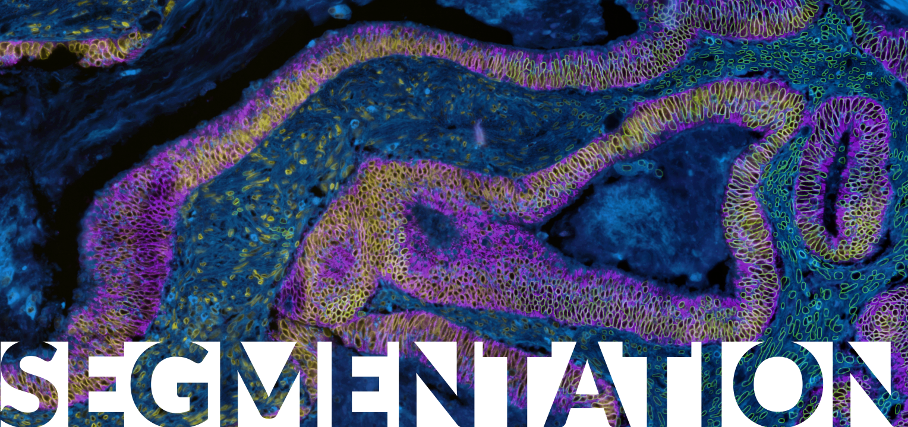

So... you want to do single-cell image segmentation?

## Prerequisite input files
S3segmenter assumes that you have:
1. acquired images of your sample with optimal acquisition settings.
2. stitched and registered the tiles and channels respectively (if working with a large piece of tissue) and saved it as a Bioformats compatible tiff file.
3. processed your image in some way so as to increase contrast between individual nuclei using classical or machine learning methods such as ilastik (a random forest model) or UnMICST (a deep learning semantic segmentation model based on the UNet architecture). MCMICRO supports both.

The s3segmenter parameters described in this manual should be provided to mcmicro via the `--s3seg-opts` flag, as shown in [Parameter Reference examples](parameter-reference.html#parameters-for-individual-modules).

## Output files
1. 32-bit label masks for each compartment of the cell: 
  * nucleiMask.tif (nuclei), 
  * cytoplasmMask.tif (cytoplasm), 
  * cellMask.tif (whole cell)
  * If only nuclei segmentation was carried out, cellMask.tif is identical to nucleiMask.tif
2. 2-channel quality control files with outlines overlaid on grayscale image of channel used for segmentation
  * nucleiOutlines.tif (nuclei), 
  * cytoplasmOutlines.tif (cytoplasm), 
  * cellOutlines.tif (whole cell)
  * If only nuclei segmentation was carried out, cellOutlines.tif is identical to nucleiOutilnes.tif

**NOTE: There are at least 2 ways to segment cytoplasm: using a watershed approach or taking an annulus/ring around nuclei. Files generated using the annulus/ring method will have ‘Ring’ in the filename whereas files generated using watershed segmentation will not. It is important that these two groups of files are **NOT** combined and analyzed simultaneously as cell IDs will be different between them.**

## Scenarios
### **1. I’m new to this whole segmentation thingy. And I have a deadline. Just get me started with finding nuclei!** 
In its simplest form, s3segmenter by default will identify primary objects only (usually nuclei) and assumes this is in channel 0 (the first channel). In this case, no settings need to be specified.

    S3seg-opts: <leave blank>
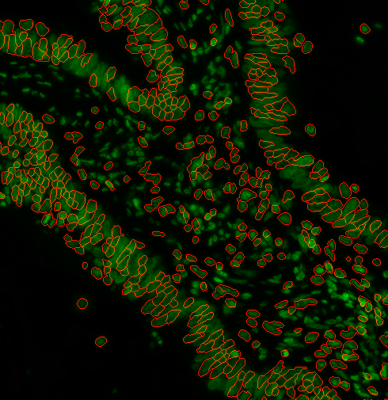
### **2. It’s a disaster. It’s not finding all the nuclei** 
Depending on the type of pre-processing that was done, you may need to use a different method of finding cells. Let’s add `--nucleiRegion localThreshold` to the options: 
`S3seg-opts: **’--nucleiRegion localThreshold’**` 
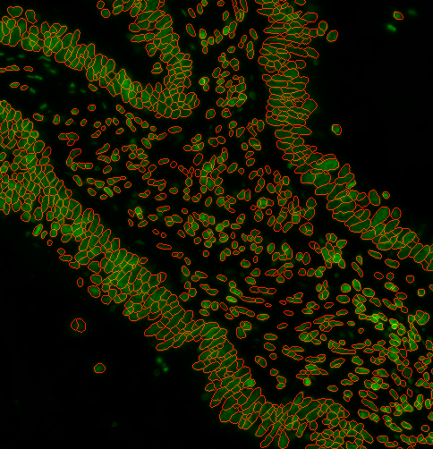 
### **3. Looks good! I want to filter out some objects based on size** 
You can specify a range of nuclei diameters that you expect your nuclei to be. Using `--logSigma <low end of range> <high end of range>`
Ie. `--logSigma 10 50` will retain all nuclei that have diameters between 10 and 50 pixels. Default is 3 60

**Examples:**
a)  
`S3seg-opts: ‘--nucleiRegion localThreshold **--logSigma 3 10’**` 
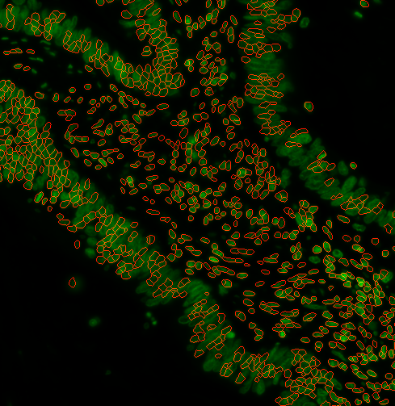 
b)  
`S3seg-opts: ‘--nucleiRegion localThreshold **--logSigma 30 60’**` 
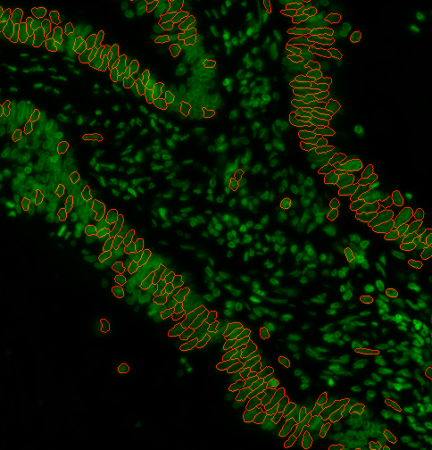 
c) default:  
`S3seg-opts: ‘--nucleiRegion localThreshold **--logSigma 3 60’**`  
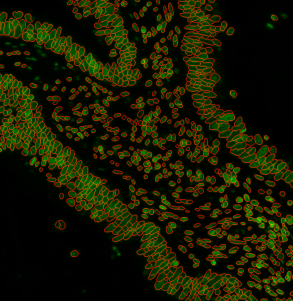 
### **4. a) How do I segment the cytoplasm as well?** 
To do this, you will need to:
1. look at your image and identify a suitable cytoplasm channel such as the example below.  
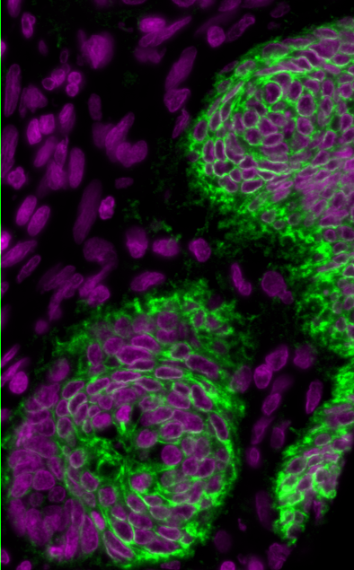 
Nuclei and cytoplasm stained with Hoechst (purple) and NaK ATPase (green) respectively.
Notice how the plasma membrane is distinctive and separates one cell from another. It also has good signal-to-background (contrast) and is in-focus.

Specify `--CytoMaskChan <channel number(s) of cytoplasm>`. For example, to specify the 10th channel, use  `--CytoMaskChan 9`. To combine and sum the 10th and 11th channels, use `--CytoMaskChan 9 10`. Doing this maximizes the ability to capture more cells.

2. Also, specify this to activate cytoplasm segmentation:
`--segmentyCytoplasm segmentCytoplasm`

`S3seg-opts: ‘--nucleiRegion localThreshold **--CytoMaskChan 9 --segmentCytoplasm segmentCytoplasm’**` 
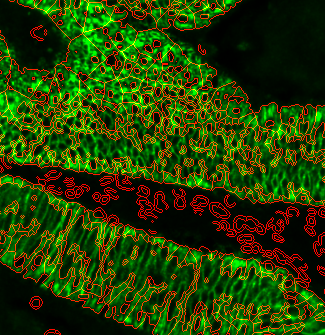 
**4. b) I don’t have a suitable cytoplasm channel…..** 
That’s ok. Cytoplasm segmentation is hard because there isn’t a universal marker. It’s generally acceptable to sample some number of pixels around the nucleus to approximate the cytoplasm.
1. Choose `--cytoMethod ring`
2. Then, specify the width of this ring `--cytoDilation <thickness of ring in pixels>` ie. `--cytoDilation 3` will surround the nuclei with a 3-pixel thick cytoplasmic ring. The default is 5 pixels.

**Examples** 
i)  
`S3seg-opts: ’--nucleiRegion localThreshold --CytoMaskChan 9 --segmentCytoplasm segmentCytoplasm **--cytoMethod ring --cytoDilation 15’**` 
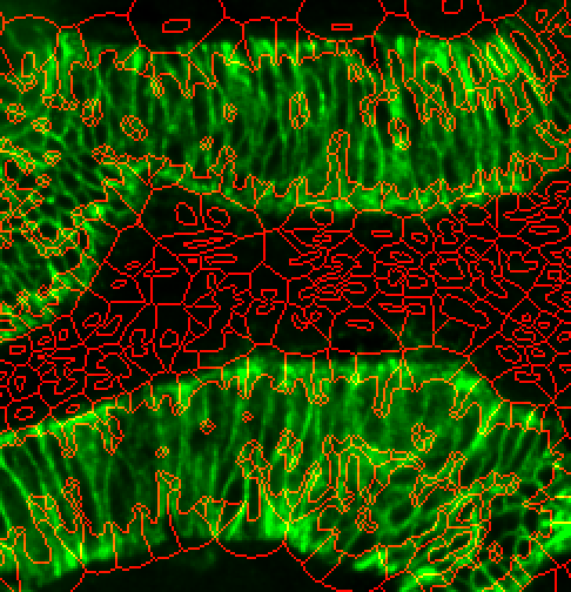 
Cytoplasm spilling beyond cytoplasm stain. Possibly too large `--cytoDilation` parameter.

ii)  
`S3seg-opts: ‘--nucleiRegion localThreshold --CytoMaskChan 9 --segmentCytoplasm segmentCytoplasm **--cytoMethod ring --cytoDilation 6’**` 
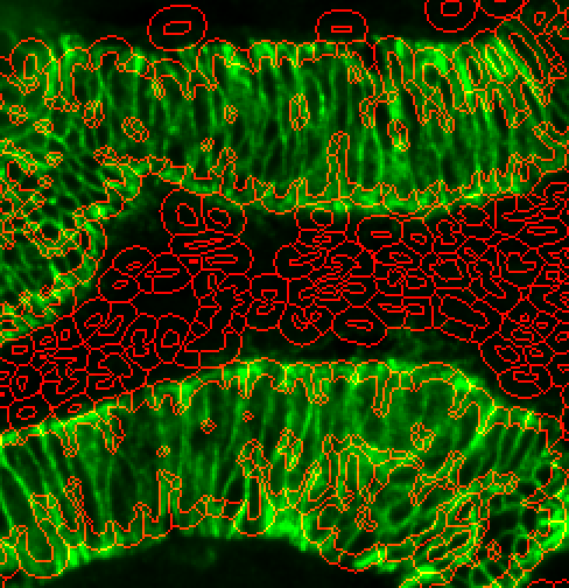 
Much better. Cytoplasm outlines now just within the marker stain.

**4. c) Are there other ways to detect the cytopolasm?** 
There’s a hybrid approach that combines a cytoplasm channel and the ring around the nuclei to deal with tissues that have sporadic cytoplasm staining.
Try changing --cytoMethod to ‘hybrid’. 

`S3seg-opts: ‘--nucleiRegion localThreshold --CytoMaskChan 9 --segmentCytoplasm segmentCytoplasm **--cytoMethod hybrid’**` 
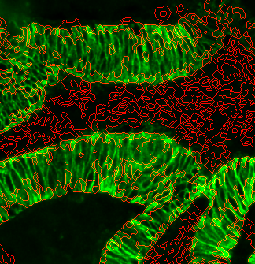 
This is still a very experimental technique and may not yield better results!

### **5. I have an instance segmentation model, which already produces a mask. How do I incorporate this in?.**
S3segmenter can accept pre-made instance segmentation primary object masks and still run some of the later functions we talked about above. To bypass nuclei segmentation, specify `--nucleiRegion bypass`. Then, you can still use `--logSigma` to filter overly small/large objects.

`S3seg-opts: ’--logSigma 45 300 **--nucleiRegion bypass’ **` 
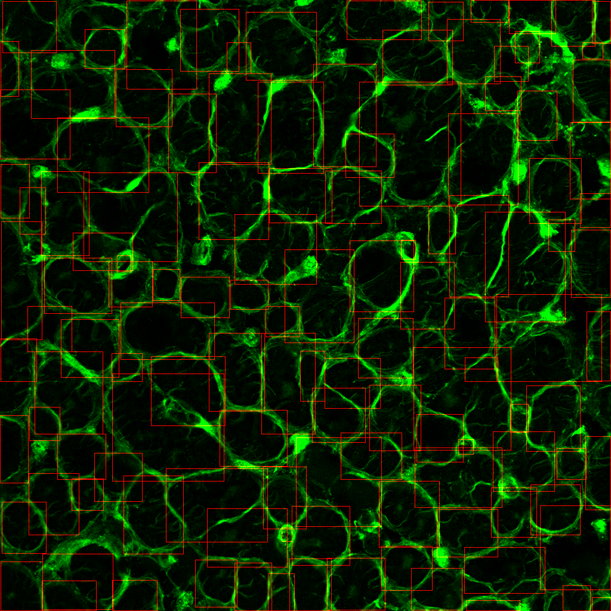
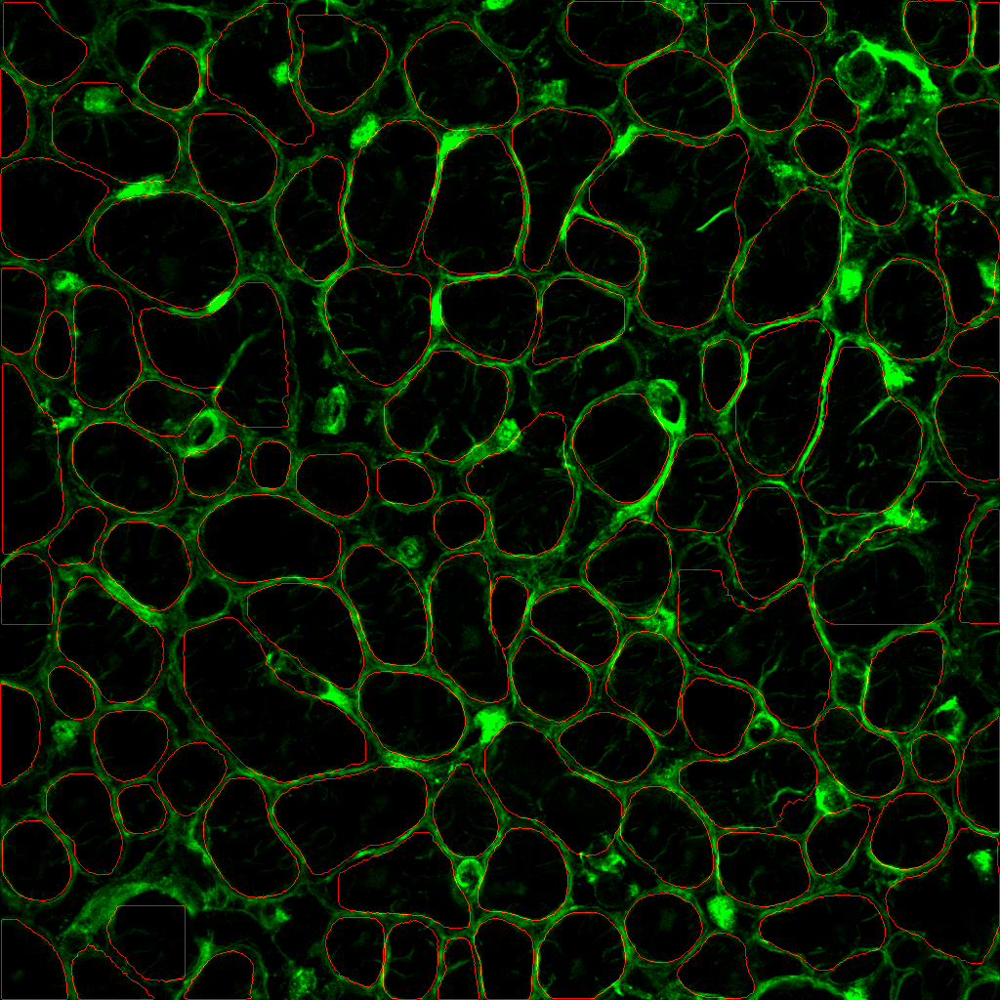

### **6. Nuclei…. Cytoplasm… NOW GIVE ME INTRACELLULAR SPOTS**
This is a very complexed operation and requires several parameters.
1. Detail which channels you want to run spot detection on.
`--detectPuncta <channel number(s)>` . ie. `--detectPuncta 0 1 2` will look for spots in the 1st, 2nd, and 3rd channels.

2. `--punctaSigma <the sigma(s) of the spots in each channel>`. This is equivalent to the standard deviation of a fitted Gaussian curve through one of your spots. 
Select custom values for each channels. 
Ie. `--punctaSigma 1.5 2 1.75`
 If you specify one value, it will use that for all channels

3. Lastly, choose the sensitivity of the spot detector.
`--punctaSD <standard deviations for each channel>`. 

Lower numbers increase sensitivity at the expense of  more false positives. Not advisable when images are very noisy. May need to work out SD empirically. 

Select custom values for each channels. 
i) ie. `--punctaSD 10 12 10` (more stringent)
Note:  If you specify one value, it will use that for all channels 
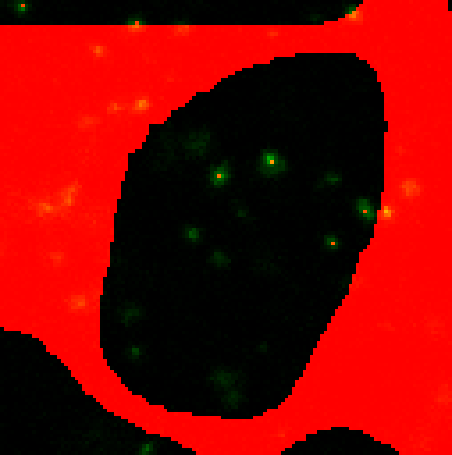 
Hmmm….only 4 puncta are being detected shown by the green dots, but there are clearly other spots not being picked up.

ii)  `--punctaSD 3 3 3` (more sensitive) 
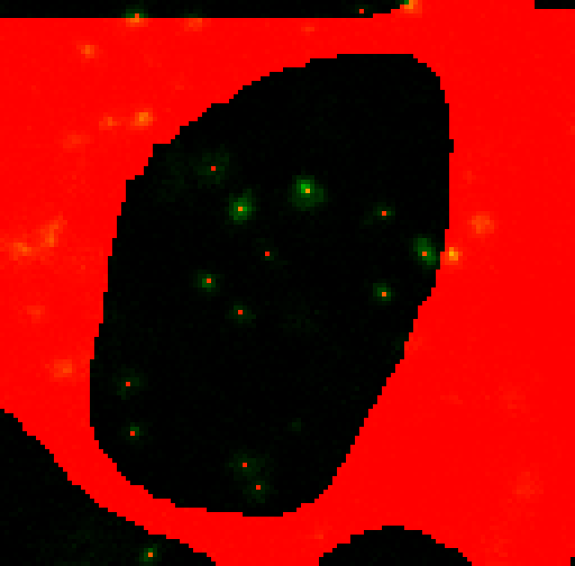 
Perfect! All visible spots appear to be detected with the more sensitive option.

`S3seg-opts: ’--logSigma 45 300 --detectPuncta 0 1 2 --punctaSigma 1.5 2 1.75 --punctaSD 3'`
